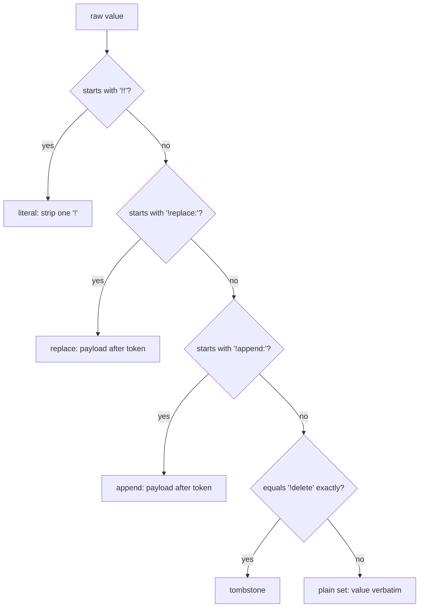

# xiom.layers -- specification

Version `0.1.0`. Pure XIOM (`module xiom.layers`), deterministic, no file I/O
and no environment reads. Conformance suite: `tests/test_conformance.xi`,
22 checks. This document is normative for the implementation in
`src/layers.xi`; where prose and code disagree, the code and the conformance
suite win and this file is the bug.

## 1. Scope

`xiom.layers` resolves an ordered stack of configuration layers into a
single flat key/value map. Keys are `Str` dotted names; values are `Str`.
The library provides: layer construction with validation, later-wins
precedence, explicit replace/append/delete sentinels with an escape for
literal text, provenance (winning layer per key), shadowed-value queries,
flattening, canonical rendering and layer-to-layer diff.

## 2. Data model

All three public types are structs of parallel vectors; `Vec[StructType]` is
not used anywhere (compiler limitation).

### 2.1 `LayerStack`

```xi
pub type LayerStack = {
  names: Vec[Str];   // layer names, precedence order (index 0 = lowest)
  keys: Vec[Str];    // every entry's key, in layer order
  vals: Vec[Str];    // every entry's raw value, index-aligned with keys
  owner: Vec[Int];   // owner[i] = layer index of entry i
}
```

Invariants (established by `layers_new` / `layers_add`):

1. `keys.len() == vals.len() == owner.len()`; every push on one of the three
   entry vectors is mirrored on the other two.
2. `owner` values are in `0 .. names.len() - 1`, non-decreasing along the
   vectors (entries are stored layer by layer, and inside a layer in the
   order the caller supplied).
3. Layer names are non-empty and unique across the stack.
4. Every key satisfies `layers_key_valid` (section 3) and is unique within
   its layer. Across layers a key may repeat: that is precedence.

### 2.2 `FlatMap`

```xi
pub type FlatMap = {
  keys: Vec[Str];    // live keys, first-introduction order
  vals: Vec[Str];    // resolved values, index-aligned with keys
  layer: Vec[Int];   // winning layer per key, index-aligned
}
```

### 2.3 `LayerDiff`

```xi
pub type LayerDiff = {
  added: Vec[Str];     // keys only in the other layer (other-layer order)
  removed: Vec[Str];   // keys only in the base layer (base-layer order)
  changed: Vec[Str];   // keys in both with different raw values (base order)
}
```

### 2.4 First-introduction order

The order in which keys are first appended to the per-key state during
resolution (section 6), i.e. the order in which each key first appears
anywhere in the stack, scanning layers 0..n-1 and entries in stored order.
Deleting a key and later resurrecting it does not move it.

## 3. Key grammar

`layers_key_valid(k)` is true iff:

- `k` is non-empty;
- every `.` (46) separates two non-empty segments (no leading, trailing or
  doubled dot);
- every other byte is greater than 32 (space) and is not one of
  `=` (61), `[` (91), `]` (93), `#` (35), `;` (59).

Comparisons are byte-exact and case-sensitive. Example: `a.b.c` is valid;
the empty string, `a..b`, `a.`, `.a`, `a b`, `a=b` and `a#b` are invalid.

## 4. Entry values and the sentinel grammar

A raw stored value is classified in this exact order
(`layers_is_escaped`, `layers_is_replace`, `layers_is_append`,
`layers_is_delete` expose the classification):

| # | Test, in order | Class | Stored text |
|---|---|---|---|
| 1 | starts with `!!` | literal escape | the value minus its first `!` |
| 2 | starts with `!replace:` | replace | bytes 9..end |
| 3 | starts with `!append:` | append | bytes 8..end |
| 4 | equals `!delete` exactly | delete | (none; tombstone) |
| 5 | anything else | plain set | the value itself |

Notes:

- Matching is case-sensitive and exact. `!delete ` (trailing space),
  `!deletex`, `!append` (no colon), `!APPEND:x` and `!replace` are plain set
  values, stored verbatim.
- A payload may be empty: `!replace:` sets the key to `""` and `!append:`
  appends an empty fold (section 6.2).
- The escape is the only way to store a value that begins with `!!`, or that
  would otherwise be read as a sentinel: `!!append:x` stores `!append:x`.



## 5. Layer order and precedence

Layers are processed in stack order: index 0 first (lowest precedence),
index `n-1` last (highest). The last entry for a key therefore wins for a
set/replace; an append folds onto everything accumulated before it; a delete
removes everything accumulated before it.

Precedence is applied per **exact dotted key path**. There is no implicit
subtree operation: writing or deleting `server` never affects `server.port`.
"Deep merge" here means the whole stack is folded per path, not that paths
form an object tree.

## 6. Resolution (`layers_flatten`)

### 6.1 Algorithm

Resolution folds the raw entries in stack order into four index-aligned
state vectors (keys, values, layers, alive), then filters. For each entry
`(k, v)` owned by layer `L`:

1. Find the state slot of `k` by byte-exact comparison (`str_compare`).
2. If `k` has no state slot, introduce it:
   - class delete: value `""`, alive `0`, layer `L`;
   - any other class: value = payload (the append/plain/escape text), alive
     `1`, layer `L`.
3. Otherwise update the slot, and always set its layer to `L`:
   - class delete: value `""`, alive `0`;
   - class append: if the slot was alive, value = old value + `,` + payload;
     if the slot was dead (or its value is not meaningful), value = payload
     (fresh); alive `1`;
   - any other class: value = payload; alive `1`.

`layers_flatten` returns the slots with alive `1`, in state order
(= first-introduction order). Dead slots are dropped; a dead key is
indistinguishable from a never-seen key in the returned `FlatMap`.
`layers_tombstones` returns the dead slots' keys in the same order.

The separator is exactly `,`. There is no escaping inside the fold: values
that themselves contain `,` are concatenated as-is (documented, not
reversible).

### 6.2 Append details

- Append on an absent key in the same layer that introduces it: value =
  payload (no leading separator).
- Append on a live key: `old + "," + payload`; an empty payload yields a
  trailing separator (e.g. `x` then `!append:` -> `x,`).
- Append on a key whose last entry was `!delete`: value = payload (fresh).
  The tombstone's `""` never contributes a separator.
- Append never inspects other keys.

### 6.3 Delete details

- `!delete` is a tombstone: the key is absent from the flattened map and
  present in `layers_tombstones`.
- Any later entry for the key (set, replace, append or escape) resurrects
  it, keeping its first-introduction position.
- `!delete` on a key that never appeared is legal and makes it a tombstone
  (it is introduced as dead).
- Deletes are path-exact (section 5).

### 6.4 Worked example

| Layer | Key | Raw value | Resolved value | Winner | Notes |
|---|---|---|---|---|---|
| 0 `defaults` | `a` | `1` | | | set |
| 0 `defaults` | `b` | `2` | | | set |
| 1 `mid` | `a` | `!append:9` | `1,9` | layer 1 | fold |
| 1 `mid` | `b` | `!delete` | (dead) | layer 1 | tombstone |
| 2 `top` | `b` | `!append:x` | `x` | layer 2 | fresh after delete |

`layers_flatten` -> keys `[a, b]` with values `["1,9", "x"]` and layers
`[1, 2]`. `layers_shadowed_values(s, "b")` -> `["2", "!delete"]` (layers
`[0, 1]`). `layers_tombstones(s)` -> `[]`.

## 7. Provenance

- Stack level: `layers_winner(s, key)` is the `owner` of the **last** entry
  for the key (any class, including delete), or `None` when the key never
  appears. For an append chain the winner is the last appender even though
  the value incorporates earlier layers.
- Map level: `flatmap_layer(m, key)` is the winning layer recorded for a
  live key, `None` when the key is absent from the map.
- For every live key, `layers_winner(s, key) == flatmap_layer(layers_flatten(s), key)`.

## 8. Shadowed-value queries

For a key `key`, let `W` be its last entry (the winner):

- `layers_shadowed_layers(s, key)` returns, in stack order, the `owner` of
  every entry for `key` strictly before `W`.
- `layers_shadowed_values(s, key)` returns the raw stored texts of those
  same entries, index-aligned with the layer vector. Sentinels appear
  verbatim (`!delete`, `!append:x`, `!!x`), never resolved.
- Absent keys produce two empty vectors. Keys with a single entry produce
  two empty vectors. A key whose winner is `!delete` reports all of its
  earlier entries as shadowed.
- Both functions are pure scans over the stack; they do not run the fold.

## 9. Ordering guarantees

- `FlatMap.keys` (and the parallel `vals` / `layer`) are in
  first-introduction order (section 2.4).
- `layers_tombstones` is in first-introduction order.
- `LayerDiff.added` / `changed` scan the other/base layers in stored entry
  order; `removed` scans the base layer in stored entry order.
- `flatmap_render` emits `keys` order.

## 10. Layer diff (`layers_diff`)

`layers_diff(s, base, other)` compares the raw entry texts of two layers of
the same stack:

- `added`: keys present in `other` and absent from `base`, in `other`'s
  stored order.
- `removed`: keys present in `base` and absent from `other`, in `base`'s
  stored order.
- `changed`: keys present in both layers whose raw stored values differ
  (byte-wise, via `str_compare`), in `base`'s stored order.

Values are compared raw: `x` in the base and `!replace:x` in the other are
`changed`, because the stored texts differ. Both indices are validated:

- `layers: no layer at index <i>` when `base` or `other` is `< 0` or
  `>= layers_count(s)`.

## 11. Canonical rendering (`flatmap_render`)

- One line per live entry: `key = value` (space, equals, space), in
  `keys` order.
- Lines joined with a single LF; **no** trailing LF; an empty map renders
  the empty string.
- A key with an empty value renders as `key = ` (trailing space).
- Values are written verbatim. There is no quoting and no parser for this
  text in this package; rendering is one-way.

## 12. Validation errors

`layers_add` returns `Err` (never writes into `s`) with exactly these
messages, checked in this order:

1. `layers: layer name must not be empty`
2. `layers: keys and values are not aligned`
3. `layers: invalid key: <key>` (first invalid key, in entry order)
4. `layers: duplicate key in layer: <key>` (first duplicate)
5. `layers: duplicate layer name: <name>` (checked against existing names)

`layers_diff` returns `Err` with `layers: no layer at index <i>` as above.
No other function in this package can fail or panic. `xiom.core.panic` is
never used by the library.

## 13. Purity, determinism, complexity

- Every function is pure: inputs are borrowed and never modified; outputs
  are freshly allocated vectors / strings; no global state, no I/O, no time,
  no randomness.
- Resolution of the same stack always yields the same `FlatMap`
  (deterministic; the conformance suite calls `layers_flatten` twice and
  compares).
- Key lookup is linear in the number of entries per fold step: `O(E * K)`
  worst case for `E` entries and `K` distinct keys, without a hash index.
  Diff and shadowed queries are `O(E)` plus `O(E)` lookups. Rendering is
  `O(total output bytes)` amortized.

## 14. Non-goals (documented limitations)

- No file I/O, environment reads, includes, variable interpolation or hot
  reload.
- No subtree delete: deletes are path-exact.
- Layers can be appended but not reordered, replaced or removed; keys inside
  a layer are unique and in caller order.
- No numeric/boolean typing: values are `Str` end to end.
- A fold is not reversible: appends join with `,` and embedded `,` are not
  quoted.
- Values are opaque byte strings; `flatmap_render` never truncates at a NUL,
  but printing through `xiom.io.println` will, so avoid NUL bytes in values.

## 15. API index

```
layers_new() -> LayerStack
layers_add(s: &LayerStack, name: Str, keys: &Vec[Str], vals: &Vec[Str]) -> Result[LayerStack, Str]
layers_count(s: &LayerStack) -> Int
layers_name(s: &LayerStack, i: Int) -> Option[Str]
layers_layer_len(s: &LayerStack, i: Int) -> Int
layers_key_valid(k: Str) -> Bool
layers_is_delete(v: Str) -> Bool
layers_is_append(v: Str) -> Bool
layers_is_replace(v: Str) -> Bool
layers_is_escaped(v: Str) -> Bool
layers_has(s: &LayerStack, key: Str) -> Bool
layers_winner(s: &LayerStack, key: Str) -> Option[Int]
layers_shadowed_layers(s: &LayerStack, key: Str) -> Vec[Int]
layers_shadowed_values(s: &LayerStack, key: Str) -> Vec[Str]
layers_flatten(s: &LayerStack) -> FlatMap
layers_tombstones(s: &LayerStack) -> Vec[Str]
layers_diff(s: &LayerStack, base: Int, other: Int) -> Result[LayerDiff, Str]
flatmap_len(m: &FlatMap) -> Int
flatmap_has(m: &FlatMap, key: Str) -> Bool
flatmap_get(m: &FlatMap, key: Str) -> Option[Str]
flatmap_layer(m: &FlatMap, key: Str) -> Option[Int]
flatmap_keys(m: &FlatMap) -> Vec[Str]
flatmap_values(m: &FlatMap) -> Vec[Str]
flatmap_entries(m: &FlatMap) -> (Vec[Str], Vec[Str])
flatmap_render(m: &FlatMap) -> Str
```

Types: `LayerStack`, `FlatMap`, `LayerDiff` (section 2).
