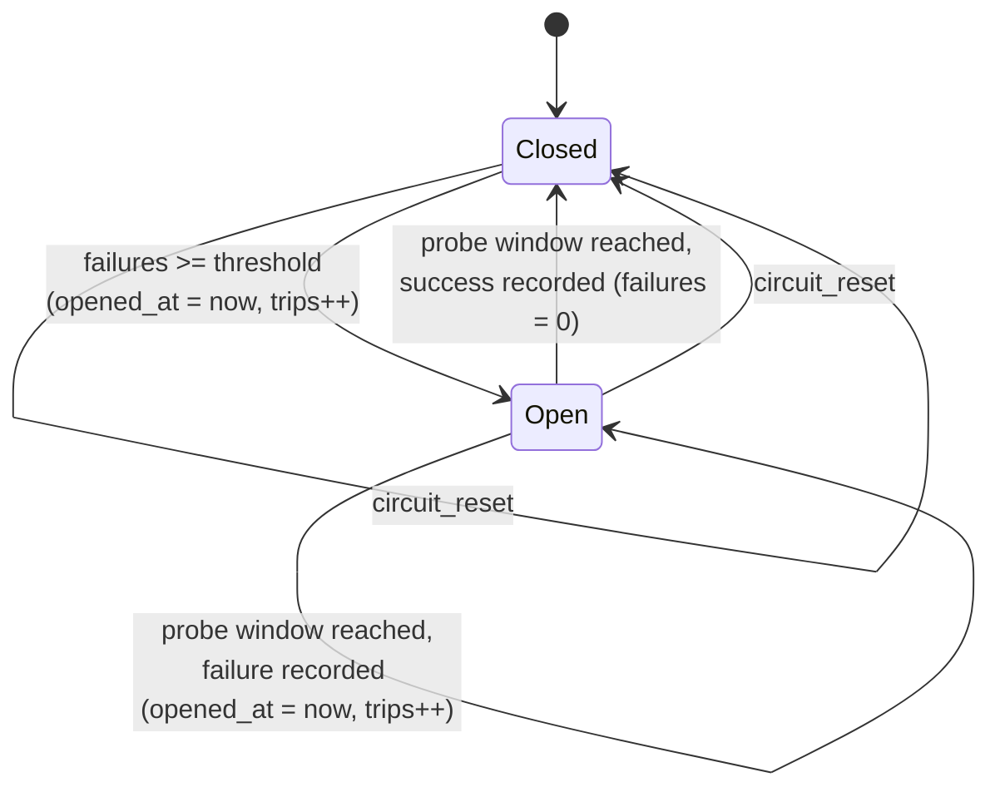

# xiom.retry -- Specification

Status: `incubating` (implemented, harness-green, not published).
Module: `xiom.retry` (`src/retry.xi`). Manifest: `package.xi` (name
`xiom.retry`, version `0.1.0`). Depends on `xiom.std` (no library imports;
tests use `xiom.test` and `xiom.io`).

## Scope

A pure deterministic retry/circuit policy engine:

- exponential backoff `base_delay_secs * factor^(attempt-1)` with an explicit
  ceiling and overflow-safe growth;
- an attempt budget with a 1-based delay query and a `should_retry` predicate;
- caller-driven retry state (`retry_state_next` consumes one attempt and
  returns the delay to wait);
- deterministic jitter derived from a caller seed, in `[delay/2, delay]`;
- circuit-breaker state with failure threshold, cooldown window, and a derived
  half-open probe state;
- bookkeeping: attempts consumed, last delay, consecutive failures, trips.

Everything is caller-owned values and explicit inputs; the module performs no
I/O, no sleeping, and no clock or environment access.

## Non-goals

- Performing the wait or the guarded call: the caller sleeps and invokes the
  operation.
- Wall-clock or monotonic time: `now_secs` is always passed in.
- Non-integer delays, Float types (a `Vec[Float64]`-adjacent compiler bug and
  the pure-Int design both exclude them).
- Randomized (cryptographic) jitter: jitter is deterministic by design.
- Thread safety, locking, or a shared breaker across threads.
- Budgets measured in elapsed time or total cost; only attempt counts.
- Generic policies over arbitrary payloads; only the numeric policy types.

## API signatures

All functions are free functions in module `xiom.retry`:

```xi
pub type RetryPolicy = { max_attempts: Int; base_delay_secs: Int;
  factor: Int; max_delay_secs: Int; }
pub type RetryState = { attempts_done: Int; last_delay_secs: Int; }
pub type CircuitBreaker = { state: Int; failures: Int;
  failure_threshold: Int; reset_after_secs: Int; opened_at: Int; trips: Int; }

pub fn retry_new(max_attempts: Int, base_delay_secs: Int, factor: Int, max_delay_secs: Int) -> RetryPolicy
pub fn retry_max_attempts(p: &RetryPolicy) -> Int
pub fn retry_base_delay_secs(p: &RetryPolicy) -> Int
pub fn retry_factor(p: &RetryPolicy) -> Int
pub fn retry_max_delay_secs(p: &RetryPolicy) -> Int
pub fn retry_delay_secs(p: &RetryPolicy, attempt: Int) -> Int
pub fn retry_should_retry(p: &RetryPolicy, attempts_done: Int) -> Bool
pub fn retry_jittered_delay(p: &RetryPolicy, attempt: Int, seed: Int) -> Int
pub fn retry_state_new() -> RetryState
pub fn retry_state_next(s: &mut RetryState, p: &RetryPolicy) -> Option[Int]
pub fn retry_state_attempts(s: &RetryState) -> Int
pub fn retry_state_last_delay(s: &RetryState) -> Int
pub fn retry_state_reset(s: &mut RetryState)
pub fn circuit_new(failure_threshold: Int, reset_after_secs: Int) -> CircuitBreaker
pub fn circuit_state(c: &CircuitBreaker) -> Int
pub fn circuit_allow(c: &CircuitBreaker, now_secs: Int) -> Bool
pub fn circuit_is_half_open(c: &CircuitBreaker, now_secs: Int) -> Bool
pub fn circuit_record_success(c: &mut CircuitBreaker, now_secs: Int)
pub fn circuit_record_failure(c: &mut CircuitBreaker, now_secs: Int)
pub fn circuit_failures(c: &CircuitBreaker) -> Int
pub fn circuit_trips(c: &CircuitBreaker) -> Int
pub fn circuit_reset(c: &mut CircuitBreaker)
```

All three types are opaque value types: fields are internal implementation
details and callers must use the constructors and accessors.

## Semantics

### RetryPolicy

`retry_new` clamps: `max_attempts >= 1`, `base_delay_secs >= 0`,
`factor >= 1`, `max_delay_secs >= base_delay_secs`. There is no error path.

`retry_delay_secs(p, attempt)` is defined for 1-based attempts:
`base_delay_secs * factor^(attempt-1)`, clamped to `max_delay_secs`.
Attempt values below 1 are treated as the first attempt. Growth stops as soon
as the delay reaches the ceiling (`delay >= max_delay_secs` breaks the loop)
and the multiply is guarded by `delay > max_delay_secs / factor`, so the
product cannot overflow and the work is bounded by the number of doublings,
not by `attempt` -- attempts far beyond the budget still return the same
clamped value.

`retry_should_retry(p, attempts_done)` is exactly
`attempts_done < max_attempts`.

### RetryState lifecycle

- `retry_state_new()`: `attempts_done = 0`, `last_delay_secs = 0`.
- `retry_state_next` while `attempts_done < max_attempts`: increments
  `attempts_done`, computes `retry_delay_secs(p, attempts_done)`, stores it in
  `last_delay_secs`, returns `Some(delay)`.
- At the budget (`attempts_done >= max_attempts`): returns `None` and changes
  nothing; `last_delay_secs` keeps the last stored value.
- `retry_state_reset` restores the fresh state.

### Jitter

`retry_jittered_delay(p, attempt, seed)`:

1. `delay = retry_delay_secs(p, attempt)`;
2. `half = delay / 2`, `span = delay - half + 1`;
3. `mixed = _retry_jitter_hash(seed, attempt)` -- an xorshift-style mix of
   seed and attempt using only non-negative shifts, so the result is
   reproducible across runs on a platform;
4. result `= half + (mixed % span)`, which lies in `[delay/2, delay]`.

Same `(p, attempt, seed)` always returns the same value. `delay = 0` yields 0.

### CircuitBreaker state machine

Stored states: `0` = closed, `1` = open. Half-open is derived: an open breaker
with `now_secs >= opened_at + reset_after_secs`.



- `circuit_allow` / `circuit_is_half_open` only read; closed always allows,
  open allows exactly from the probe window on.
- `circuit_record_failure`:
  - closed: `failures++`; when `failures >= failure_threshold`, opens
    (`state = 1`, `opened_at = now_secs`, `trips++`);
  - open, probe window reached: the probe failed -- `opened_at = now_secs`,
    `trips++`, `state` stays open, `failures` is unchanged;
  - open, before the window: nothing changes (a stray failure report cannot
    extend the cooldown or move `opened_at`).
- `circuit_record_success`: `failures = 0`, `state = closed`; `now_secs` is
  stored in `opened_at` as the closing time and is never read while closed.
- `circuit_failures` is consecutive failures since the last success/reset and
  is frozen while open. `circuit_trips` counts opens: the initial trip plus
  every failed probe.
- `circuit_reset`: closed, zero failures, zero trips, `opened_at = 0`.
- `circuit_new` clamps `failure_threshold >= 1`, `reset_after_secs >= 0`.

Error paths: none. Every getter is total; hostile or stale `now_secs` values
only affect the documented window comparisons.

## Complexity

| Operation | Complexity |
|---|---|
| `retry_new`, all policy accessors | O(1) |
| `retry_delay_secs` | O(min(attempt, log(max_delay / base_delay))) |
| `retry_should_retry`, `retry_jittered_delay` | O(1) plus `retry_delay_secs` |
| `retry_state_*` | O(1) plus `retry_delay_secs` in `retry_state_next` |
| `circuit_new`, all circuit functions | O(1) |

## Test plan

`tests/test_conformance.xi` (`module retry_tests`, 21 named checks, hello-style
`main` that prints `[PASS]`/`[FAIL]` per check, a summary line, and returns the
failure count):

1. delay grows 1,2,4,8 with base 1 factor 2;
2. delay clamps at `max_delay_secs`;
3. factor 1 keeps the delay constant;
4. constructor clamps attempts, base, factor and ceiling;
5. accessors return the constructor values;
6. attempts beyond the budget stay clamped and formulaic;
7. `should_retry` stops exactly at the attempt budget;
8. state yields `Some(1)`, `Some(2)`, `Some(4)` then `None`;
9. state reset restores a fresh counter;
10. `last_delay` tracks the most recent computed delay;
11. jittered delay stays inside `[delay/2, delay]` across seeds and attempts;
12. same seed and attempt give the same jitter;
13. closed breaker allows calls;
14. failures trip the breaker at the threshold;
15. open breaker blocks calls before the reset window;
16. allow resumes at `opened_at + reset_after_secs`;
17. half-open starts exactly at the probe window;
18. successful probe closes the breaker and clears failures;
19. failed probe re-opens the window and bumps trips;
20. `circuit_reset` restores the closed breaker;
21. `circuit_new` clamps threshold to 1 and window to 0.

Run from the repository root:

```
.\scripts\port.ps1 -Package xiom.retry
```

Last verified: compiler 0.61.3, `port: PASS (passed=21 failed=0 exit=0)`.

## Known limitations

- Pure policy engine: the caller sleeps and performs the guarded call; the
  module has no clock, no environment access, no I/O.
- Integer seconds only; there is no sub-second or Float delay support.
- Jitter is deterministic (seed+attempt hash), not a randomness source.
- `failures` is frozen while the breaker is open; a failure report before the
  probe window is ignored by design.
- The breaker is a plain value; sharing it across threads is the caller's
  problem (no locking).
- `opened_at` doubles as the last-close time after `circuit_record_success`;
  it is only read while open, so this is not observable through the API.
- Attempt counts and times are caller-supplied `Int`s; extreme values wrap with
  the platform's 64-bit signed arithmetic rather than trapping.

## Compiler / stdlib notes for v0.61.3

- `Str` values read from `Vec[Str]` must be compared with
  `xiom.string.compare.str_compare` (BUG 17). This module has no `Vec[Str]`
  and no Str comparisons, so it does not import `xiom.string.compare`.
- Advisory E001 ("cannot borrow as mutable while immutably borrowed") fires
  when a `&local` call is followed by a `&mut local` call on the same local in
  one function. The tests route read-only checks through tiny helpers that
  take `&mut` and call the real `&`-based API internally; the harness run is
  warning-free.
- The compiler bug where constructing `Ok(x)`/`Err(x)` inside a function
  whose return type is a struct miscompiles is avoided entirely: the module
  uses no `Result`, and the tests use plain `assert`.
- `retry_state_next` mixes a `&mut RetryState` with a `&RetryPolicy`; the
  field reads through both references compile and run correctly on 0.61.3
  (covered by test 8/10).
